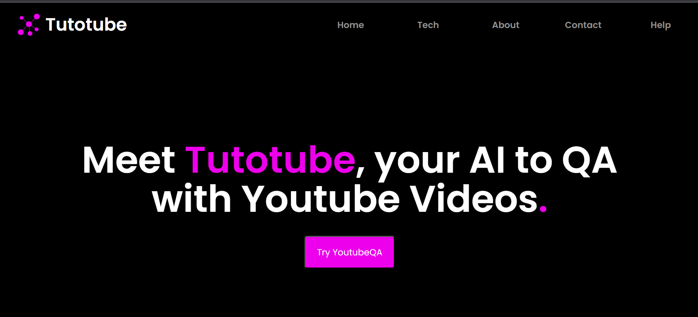

<!-- Improved compatibility of back to top link: See: https://github.com/Shahil9728/TutoTube/ -->
<a name="readme-top"></a>


<!-- PROJECT LOGO -->
<br />
<div align="center">
  <a href="https://github.com/Shahil9728/TutoTube">
    
  </a>

  <h3 align="center"><a href="https://tutotube-frontend.onrender.com" target="_blank">TutoTube</a></h3>
  <p align="center">
    <br />
    <br />
    <a href="https://github.com/Shahil9728/TutoTube/issues">Report Bug</a>
    ·
    <a href="https://github.com/Shahil9728/TutoTube/issues">Request Feature</a>
  </p>
</div>

### TutoTube

### Project Link: [https://tutotube-frontend.onrender.com](https://tutotube-frontend.onrender.com)
Must visit it for better view !🥰 

### Introduction

Welcome to our AI-powered platform, where getting answers to your questions is as easy as providing a YouTube video link. Our platform is purposefully designed to extract relevant information from a single video and produce accurate responses to your inquiries. With our website, you can save time and effort by quickly accessing the information you need from a video. Our AI system scrutinizes the video you provide and extracts the necessary information to answer your question. This makes our platform an extremely precise and efficient means of obtaining knowledge from video content. Our user-friendly website is accessible to anyone seeking valuable insights on a broad range of subjects. Join us today to experience the groundbreaking power of our AI technology! The application built with MERN stack integrates OpenAI and LangChain technologies to provide an accurate and efficient question-answering system that generates transcripts from YouTube videos.


### DOCUMENTATION

1. The platform generates a video transcript using the OpenAI "Whisper" API from a YouTube video link.

2. The transcript is embedded with LangChain and OpenAI to enable efficient similarity search, and users can ask questions and receive accurate answers using the embedded text.

3. The platform offers a user-friendly interface for easy interaction with YouTube video links and can be extended to support other types of documents for question-answering


### Installation

## Step 1
Clone the Github Repository
```shell
git clone https://github.com/Shahil9728/TutoTube
```

## Step 2
Open terminal and then 
Open the backend server and create the .env file and include this
```shell
API_KEY = ''
MONGO_URL = ''
```

## Step 3
Run the backend server
```shell
node app.js
```
## Step 4
Open another terminal, and then
Open the frontend react js And run the frontend server
```shell
cd client
npm start
```

## Step 5 
Access the application in your web browser.


<!-- IMAGES -->
### WEBSITe SCREENSHOTS



<br/>


### APPLICATION WORKFLOW

1. The user inputs a YouTube video link into the application's user interface.

2. The application uses the Youtube-transcript module to fetch the video's transcript directly from YouTube, or if unavailable, it uses the ytdl-core npm package to download the audio and then generates the transcript using the OpenAI "Whisper API".

3. The text transcripts generated by the application are saved both in a file and in a MongoDB database. To enable efficient similarity search, the application breaks the transcript into smaller chunks and generates embeddings using Langchain and OpenAI embedding models. These embeddings are then stored in the application's datastore for similarity search.

4. When a user queries the application, Langchain performs a similarity search on the embedded vectors and returns the most relevant answer.

5. The application displays the answer to the user through the user interface.

<br>


### CONTRIBUTION

1. I welcome contributions from anyone who would like to improve and enhance the functionality of this application.

2. To contribute, first, fork the repository to your own GitHub account, preferably the locale branch.

3. Clone the forked repository to your local machine and create a new branch for your contribution.

4. After making the necessary changes, test them locally and commit with clear and descriptive messages.

5. Push the changes to your forked repository and submit a pull request to the main repository with a detailed description of your changes.

6. It is important to follow the coding style and best practices used in the project and provide clear and concise documentation for any new features or changes.

7. Ensure that the changes made are thoroughly tested to prevent introducing any new bugs.

Be open to feedback and willing to make changes as required.
Thank you for your contributions in advance. Working together, we can make this application even better


<br>

### Built With

This section lists about the languages used in this project .

* 
* 
* 
* 
* 
* 
* 
* 


<br>

<p align="right">(<a href="#readme-top">back to top</a>)</p>

<!-- CONTACT -->
## Contact

Your Name - [@Shahil9728](https://twitter.com/Shahil9728) - shahilverma91383@gmail.com

Project Link: [https://tutotube-frontend.onrender.com](https://tutotube-frontend.onrender.com)

<p align="right">(<a href="#readme-top">back to top</a>)</p>


<br>


### CONCLUSION

Our AI-powered platform provides accurate and efficient answers to your questions by extracting relevant information from a single YouTube video link. Our user-friendly website is accessible to anyone seeking valuable insights on a broad range of subjects. Join us today to experience the groundbreaking power of our AI technology!


